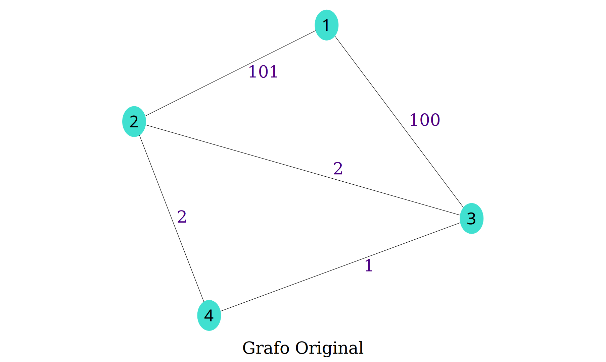
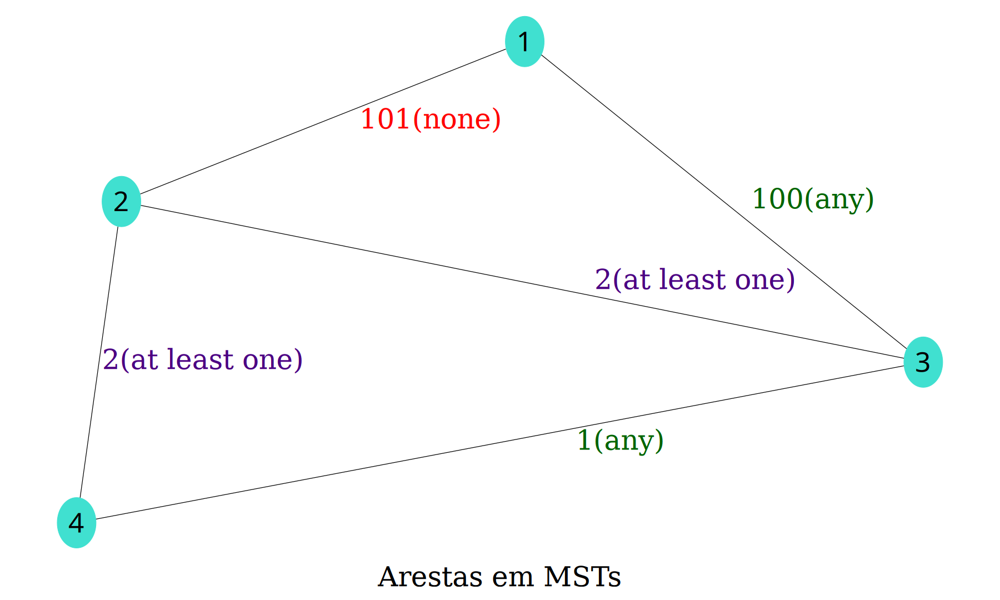
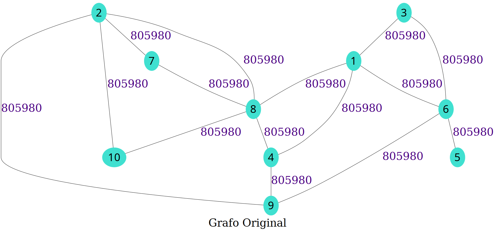
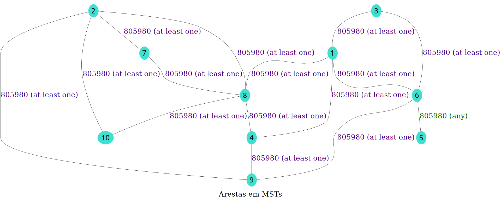

# Edges in Minimun Spanning Tree (MST)

**Número da Lista**: 2<br>
**Conteúdo da Disciplina**: Grafos<br>

## Alunos

|Matrícula | Aluno |
| -- | -- |
| 15/0129815 | Ícaro Pires de Souza Aragão |
| 16/0144752 | Sara Conceição de S. A. Silva |

## Sobre 

Nessa atividade será resolvido um problema de um *contest* do Codedorces, o [160D - Edges in MST](https://codeforces.com/contest/160/problem/D) que, dado um grafo, procura saber se cada uma das arestas pode estar presente em todas as possíveis MSTs, em ao menos uma ou em nenhuma.  

O problema foi resolvido utilizando o algoritmo de Kruskal para identifcar uma das MSTs e o de Tarjan para identificação de pontes. A solução utilizada aqui foi submetida e aprovada no próprio Codeforces e pode ser visualizada [aqui](https://codeforces.com/contest/160/submission/60700691)

Além disso foi elaborada uma visualização para melhor compreensão do problema e da solução.

## Visualização

### Input Pequeno

#### Input



#### Solução



### Input Grande

#### Input



#### Solução



## Instalação 

**Linguagem**: Python 3.7

Instale o pacote graphviz da sua distribuição. Ex:

``` sh
# No Fedora
sudo dnf install graphviz

# Ou no Arch
sudo pacman -S graphviz
```

e instale as dependências do python com:

``` sh
# Ou apenas pip ao invés de pip3 no Arch
# É melhor instalar na virtualenv ao invés de no usuário
pip3 install -r requirements.txt --user
```

## Uso 

Após a instalação das dependências basta executar o seguinte comando:

``` sh
python3 solution.py
```

e seguir as intruções exibidas para gerar seu problema e sua solução.
